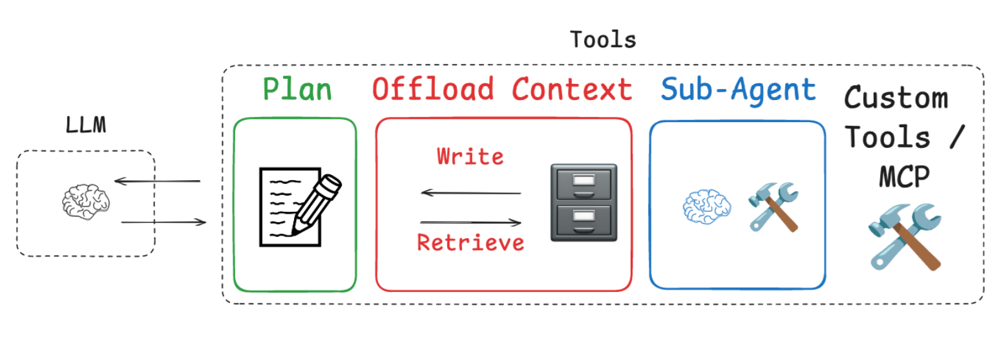
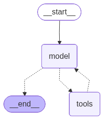
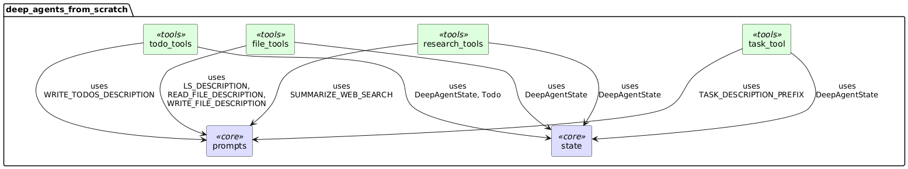
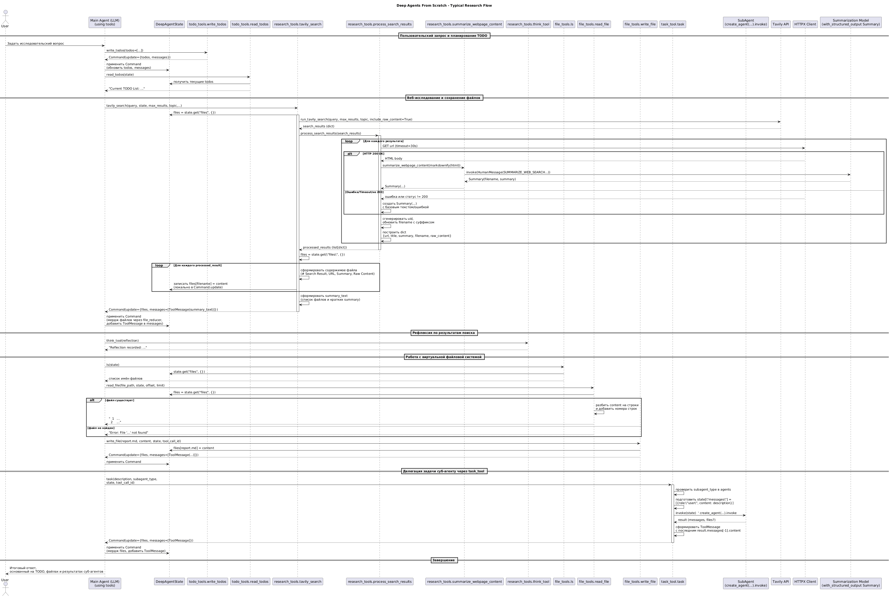
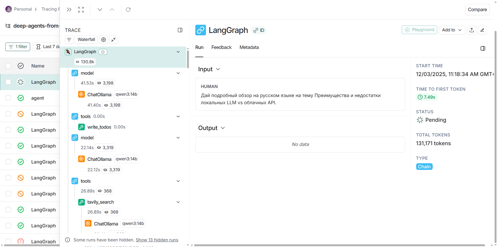
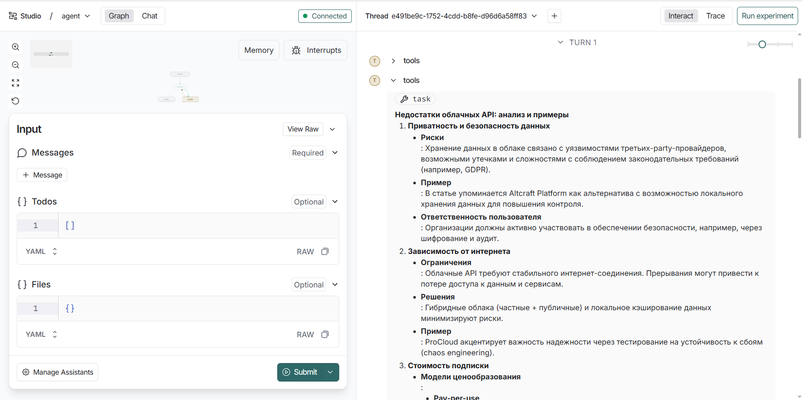

# 🧠 Local-Deep-Agents-from-Scratch
LocalDeepAgents_01

Создание локальных Deep Agents на базе **LangGraph**, **LLMs**, **файловой памяти**, **планирования** и **субагентов**.

---

Использованные материалы:

https://github.com/langchain-ai/deep-agents-from-scratch

---

# 📌 Оглавление

1. [Введение](#введение)
2. [Архитектура Deep Agent](#архитектура-deep-agent)
3. [Базовый строительный блок: create_react_agent](#базовый-строительный-блок-create_react_agent)
4. [Планирование через todo-листы](#планирование-через-todo-листы)
5. [Внешняя память: файловая система](#внешняя-память-файловая-система)
6. [Субагенты и делегирование](#субагенты-и-делегирование)
7. [Think-tool: управляемая рефлексия](#think-tool-управляемая-рефлексия)
8. [Сборка Deep Research Agent](#сборка-deep-research-agent)
9. [DeepAgents — готовая абстракция](#deepagents--готовая-абстракция)
10. [Примеры кода](#примеры-кода)
11. [Заключение](#заключение)

---

# 🧭 Введение

Deep Agents — это архитектурный подход к созданию автономных агентов, устойчивых к длинным задачам (20–100+ шагов).  
Основан на практиках систем:

- **Manus**
- **Claude Code**
- **OpenAI Deep Research**
- **Anthropic Multi-Agent Researcher**

Ключевые элементы:

- Планирование (todos)  
- Контекстное offloading (files)  
- Субагенты  
- Системные промпты  
- Модульная архитектура LangGraph



---

# 🧱 Архитектура Deep Agent

Deep Agent состоит из четырёх основных модулей:

```

┌──────────────────────────┐
│        Supervisor        │
│     (главный аген        │
└──────────┬───────────────┘
           │ Delegation
┌──────────▼───────────────┐
│        Subagent          │
│  (исследователь, кодер)  │
└──────────┬───────────────┘
           │ Tools
┌──────────▼───────────────┐
│  File System  |  Todos   │
│ (внешняя память агента   │
└──────────────────────────┘

````

---

# ⚙️ Базовый строительный блок: `create_react_agent`

LangGraph предоставляет преднастроенный агент ReAct:

```python
from langgraph.prebuilt import create_react_agent

agent = create_react_agent(
    model=my_llm,
    tools=[...],
    prompt="You are a helpful assistant."
)
````

Функции:

* управление состоянием,
* вызовы инструментов,
* условные переходы,
* визуализация графа,
* поддержка Command.




---

# 📝 Планирование через todo-листы

Пример todo-инструмента:

```python
@tool
def write_todos(todos: list[Todo], state: InjectedState, tool_call_id):
    return Command(update={
        "todos": todos,
        "messages": [ToolMessage("Todos updated", tool_call_id)]
    })
```

Todo-лист служит:

* планом действия,
* трекером прогресса,
* наброском траектории агента.

---

# 💾 Внешняя память: файловая система

Deep Agent хранит данные не в контексте LLM, а в state.files:

```python
files = {
  "page_1.md": "... markdown ...",
  "user_request.txt": "Find info about MCP"
}
```

Примеры инструментов:

```python
@tool
def write_file(path: str, content: str, state: InjectedState, tool_call_id):
    return Command(update={"files": {path: content}})
```

Используется для:

* raw tool calls,
* черновиков,
* промежуточных данных,
* больших текстов.

---

# 🤖 Субагенты и делегирование

Субагенты — это независимые агенты со своими промптами.

Пример описания субагента:

```python
research_subagent = {
  "name": "research-agent",
  "description": "Performs deep research tasks.",
  "prompt": "...",
  "tools": ["tavily_search", "read_file"]
}
```

Главный агент вызывает их через `task_tool`.

---

# 🧠 Think-tool: управляемая рефлексия

Это no-op инструмент:

```python
@tool
def think_tool(thought: str):
    return f"[THOUGHT]: {thought}"
```

Используется для:

* анализа прогресса,
* обнаружения ошибок,
* аудита reasoning.

---

# 🏗 Сборка Deep Research Agent

Система объединяет:

* todos,
* files,
* subagents,
* think-tool,
* Tavily search,
* summary модели.

Flow:

1. Сохранить запрос → файл
2. Составить todo-лист
3. Делегировать работу research-agent
4. Сохранить сырые данные (markdown)
5. Обновить todo
6. Вернуть финальный отчёт

---

# 📦 DeepAgents — готовая абстракция

Библиотека DeepAgents уже содержит:

* todo-инструменты,
* файловую систему,
* task_tool,
* think-tool,
* supervisor + subagent инфраструктуру.

Репозиторий доступен в разделе Resources.

---

# 🧪 Примеры кода

Пример вызова агента:

```python
result = agent.invoke({"messages": [
  {"role": "user", "content": "Give me an overview of MCP"}
]})
```

Пример чтения файлов:

```python
agent_state["files"]["page_1.md"]
```

---


# 🧠 Обзор исходного кода модулей Deep Agents (from scratch)

Этот документ даёт **структурированный обзор исходного кода** всех основных модулей:

- `state.py` — состояние агента  
- `prompts.py` — промпты и описания инструментов  
- `fs_tools.py` (условное имя) — виртуальная файловая система  
- `todo_tools.py` — управление TODO-списком  
- `research_tools.py` — веб-поиск и суммаризация  
- `task_tool.py` — делегирование задач субагентам  

Цель: помочь быстро понять **архитектуру** и **назначение каждого модуля**, не зарываясь сразу в детали реализации.


* `state` — базовый модуль состояния, ни от кого внутри пакета не зависит.
* `prompts` — базовый модуль текстовых шаблонов, тоже ни от кого внутри пакета не зависит.
* `todo_tools`:

  * использует `DeepAgentState` и `Todo` из `state`;
  * использует `WRITE_TODOS_DESCRIPTION` из `prompts`.
* `file_tools`:

  * использует `DeepAgentState` из `state`;
  * использует описания инструментов `LS_DESCRIPTION`, `READ_FILE_DESCRIPTION`, `WRITE_FILE_DESCRIPTION` из `prompts`.
* `research_tools`:

  * использует `DeepAgentState` из `state`;
  * использует `SUMMARIZE_WEB_SEARCH` из `prompts`.
* `task_tool`:

  * использует `DeepAgentState` из `state`;
  * использует `TASK_DESCRIPTION_PREFIX` из `prompts`.

Таким образом, `state` и `prompts` — общие базовые компоненты, а все “tool”-модули зависят от них.



---

## 📂 1. `state.py` — состояние агента (DeepAgentState)

### Назначение

Модуль отвечает за **расширенное состояние агента**, на котором строится весь Deep Agent:

- поддержка **TODO-списков** (планирование),
- поддержка **виртуальной файловой системы** (контекст как файлы),
- корректное **слияние состояния** через редьюсер.

### Ключевые сущности

#### `Todo`

```python
class Todo(TypedDict):
    content: str
    status: Literal["pending", "in_progress", "completed"]
````

**Для чего:**

* описывает одну задачу в TODO-списке:

  * `content` — текст задачи,
  * `status` — состояние выполнения.

#### `file_reducer(left, right)`

```python
def file_reducer(left, right):
    if left is None:
        return right
    elif right is None:
        return left
    else:
        return {**left, **right}
```

**Для чего:**

* задаёт правила, как объединять два словаря файлов:

  * `right` перекрывает `left`,
  * используется как редьюсер для поля `files` в состоянии.

#### `DeepAgentState(AgentState)`

```python
class DeepAgentState(AgentState):
    todos: NotRequired[list[Todo]]
    files: Annotated[NotRequired[dict[str, str]], file_reducer]
```

**Для чего:**

* расширяет базовый `AgentState` из LangChain/LangGraph,
* добавляет:

  * `todos` — список задач,
  * `files` — виртуальная ФС (имя файла → содержимое),
* подключает редьюсер `file_reducer` к `files`.

**Роль в системе:**

Это **центральная структура памяти** Deep Agent:

* `messages` (наследуются) — краткосрочная память,
* `todos` — структурированное планирование,
* `files` — долговременная и объёмная память.

---

## 🧾 2. `prompts.py` — промпты и описания инструментов

### Назначение

Модуль содержит **все текстовые шаблоны**, которые управляют поведением агента:

* описания инструментов для LLM,
* системные промпты для соблюдения стратегий,
* инструкции для субагентов и суперагента.

### Основные блоки

#### TODO-инструменты

* `WRITE_TODOS_DESCRIPTION`
  — описание для инструмента `write_todos`.

* `TODO_USAGE_INSTRUCTIONS`
  — инструкции для суперагента:

  * когда создавать TODO-лист,
  * как его обновлять,
  * как использовать для плана исследования.

#### Файловая подсистема

* `LS_DESCRIPTION`
* `READ_FILE_DESCRIPTION`
* `WRITE_FILE_DESCRIPTION`
* `FILE_USAGE_INSTRUCTIONS`

Используются:

* как `description` для инструментов `ls`, `read_file`, `write_file`,
* как часть системной подсказки (supervisor prompt).

#### Суммаризация веб-страниц

* `SUMMARIZE_WEB_SEARCH`

Шаблон промпта для summarization-модели:

* принимает `{webpage_content}` и `{date}`,
* просит:

  * кратко пересказать смысл,
  * указать тип контента,
  * предложить имя файла,
* ожидает JSON-ответ с полями `filename` и `summary`.

#### Промпт research-субагента

* `RESEARCHER_INSTRUCTIONS`

Описывает:

* как агент должен выполнять веб-исследование,
* использование `tavily_search` и `think_tool`,
* лимиты по количеству tool calls,
* когда нужно остановиться.

#### Делегирование субагентам

* `TASK_DESCRIPTION_PREFIX`
* `SUBAGENT_USAGE_INSTRUCTIONS`

Описывают:

* какие субагенты доступны,
* как делегировать задачи через `task(description, subagent_type)`,
* как использовать параллельные субагенты,
* лимиты по числу делегирований и параллельных агентов.

---

## 📁 3. `fs_tools.py` — виртуальная файловая система

*(Имя условное, основано на содержимом кода)*

### Назначение

Реализует три инструмента:

* `ls` — список файлов,
* `read_file` — чтение содержимого,
* `write_file` — запись/перезапись файла.

Работает поверх `DeepAgentState.files`.

### Основные функции

#### `ls(state) -> list[str]`

```python
@tool(description=LS_DESCRIPTION)
def ls(state: Annotated[DeepAgentState, InjectedState]) -> list[str]:
    return list(state.get("files", {}).keys())
```

* возвращает список имён файлов,
* `state` передаётся как `InjectedState` — модель его не видит.

#### `read_file(file_path, state, offset=0, limit=2000) -> str`

* проверяет, существует ли файл,
* если пустой — возвращает напоминание,
* поддерживает чтение по строчно с `offset` и `limit`,
* возвращает строки с номерами (как `cat -n`),
* не меняет состояние, только читает.

#### `write_file(file_path, content, state, tool_call_id) -> Command`

* обновляет / создаёт файл в `state.files`,
* возвращает `Command(update={...})`, который:

  * записывает файл,
  * добавляет `ToolMessage("Updated file ...")`.

**Роль в системе:**

* хранит сырые данные (результаты поиска),
* хранит запрос пользователя,
* помогает агенту экономить токены,
* обеспечивает обратимость компрессии контекста.

---

## ✅ 4. `todo_tools.py` — управление TODO-списком

### Назначение

Обеспечивает инструменты:

* для создания/обновления TODO-листа;
* для чтения и визуализации текущих задач.

### Основные функции

#### `write_todos(todos, tool_call_id) -> Command`

```python
@tool(description=WRITE_TODOS_DESCRIPTION, parse_docstring=True)
def write_todos(
    todos: list[Todo], tool_call_id: Annotated[str, InjectedToolCallId]
) -> Command:
    return Command(
        update={
            "todos": todos,
            "messages": [
                ToolMessage(f"Updated todo list to {todos}", tool_call_id=tool_call_id)
            ],
        }
    )
```

* получает список `Todo`,
* полностью обновляет поле `todos` в состоянии,
* добавляет `ToolMessage` для трассировки.

#### `read_todos(state, tool_call_id) -> str`

```python
@tool(parse_docstring=True)
def read_todos(
    state: Annotated[DeepAgentState, InjectedState],
    tool_call_id: Annotated[str, InjectedToolCallId],
) -> str:
    ...
```

* читает `state["todos"]`,
* если пусто — сообщает об отсутствии,
* форматирует список задач с эмодзи по статусу.

**Роль в системе:**

* даёт агенту «ось» для планирования работы,
* используется в инструкциях:

  * создать TODO в начале,
  * перечитывать TODO после шагов,
  * обновлять статус по мере выполнения.

---

## 🔎 5. `research_tools.py` — веб-поиск и суммаризация

### Назначение

Реализует **поисковую часть** Deep Agent:

* веб-поиск через Tavily,
* скачивание содержимого по URL,
* конвертация HTML → markdown,
* суммаризация контента через LLM,
* сохранение результатов в файлы,
* возврат компактной сводки в сообщения.

### Основные элементы

#### Глобальные объекты

```python
summarization_model = init_chat_model(model="openai:gpt-4o-mini")
tavily_client = TavilyClient()
```

* модель для суммаризации (`with_structured_output`),
* клиент Tavily для поиска.

#### `Summary` (Pydantic)

```python
class Summary(BaseModel):
    filename: str
    summary: str
```

* схема структурированного вывода для LLM,
* помогает получать JSON с именем файла и summary.

#### `run_tavily_search(...) -> dict`

* обёртка над `tavily_client.search(...)`,
* принимает query, max_results, topic,
* возвращает dict с результатами Tavily.

#### `summarize_webpage_content(webpage_content: str) -> Summary`

* вызывает `summarization_model.with_structured_output(Summary)`,
* подставляет контент и дату в `SUMMARIZE_WEB_SEARCH`,
* возвращает `Summary`,
* при ошибке — fallback: filename = `search_result.md`, summary = обрезанный текст.

#### `process_search_results(results: dict) -> list[dict]`

* итерируется по `results['results']`,
* пытается скачать HTML через `httpx.Client`,
* конвертирует в markdown через `markdownify`,
* вызывает `summarize_webpage_content`,
* генерирует уникальное имя файла (UUID+base64),
* возвращает список:

  * `url`, `title`, `summary`, `filename`, `raw_content`.

#### Инструмент `tavily_search(...) -> Command`

```python
@tool(parse_docstring=True)
def tavily_search(
    query: str,
    state: Annotated[DeepAgentState, InjectedState],
    tool_call_id: Annotated[str, InjectedToolCallId],
    max_results: Annotated[int, InjectedToolArg] = 1,
    topic: Annotated[Literal["general", "news", "finance"], InjectedToolArg] = "general",
) -> Command:
    ...
```

* делает поиск `run_tavily_search`,
* обрабатывает результаты `process_search_results`,
* сохраняет каждый результат в `files[filename]` в виде:

  * заголовок,
  * URL,
  * запрос,
  * дата,
  * summary,
  * raw content (markdown),
* формирует компактный текст для `ToolMessage`:

  * список файлов + краткие summary,
* возвращает `Command`, обновляющий `files` и `messages`.

#### Инструмент `think_tool(reflection: str) -> str`

* no-op инструмент для рефлексии:

  * принимает текст размышления,
  * возвращает `"Reflection recorded: ..."`.

**Роль в системе:**

* разгружает контекст:

  * большие тексты → в файлы,
  * короткие summary → в messages;
* даёт агенту чёткий паттерн исследовательской работы;
* через think-tool обеспечивает контролируемое «thinking».

---

## 🤝 6. `task_tool.py` — делегирование задач субагентам

### Назначение

Реализует механизм:

* создания субагентов,
* изоляции их контекста,
* делегирования им задач через инструмент `task()`.

### Основные элементы

#### `SubAgent` (TypedDict)

```python
class SubAgent(TypedDict):
    name: str
    description: str
    prompt: str
    tools: NotRequired[list[str]]
```

* описывает конфигурацию субагента:

  * имя,
  * описание (для суперагента),
  * системный промпт,
  * список инструментов (подмножество глобальных).

#### `_create_task_tool(tools, subagents, model, state_schema) -> tool`

* принимает:

  * общий список инструментов,
  * список конфигураций субагентов,
  * модель,
  * схему состояния;
* создаёт:

  * словарь `agents[name] = create_agent(...)`,
  * инструмент `task(...)` с описанием `TASK_DESCRIPTION_PREFIX`.

#### Инструмент `task(description, subagent_type, state, tool_call_id)`

* проверяет, что `subagent_type` существует;
* берёт соответствующий субагент;
* **изолирует контекст**:

  * перезаписывает `state["messages"] = [{"role": "user", "content": description}]`;
* вызывает `sub_agent.invoke(state)`;
* собирает результат и формирует `Command(update={...})`:

  * копирует `files` из результата,
  * создаёт `ToolMessage` с **последним сообщением** субагента.

**Роль в системе:**

* главный агент делегирует:

  * «исследуй такую-то тему»,
  * «проанализируй этот источник»,
  * «сравни X и Y»;
* субагент:

  * работает в чистом контексте,
  * видит только своё задание,
  * делает нужное количество tool calls.

Это основной механизм для **deep**-части Deep Agents.

---

## 🧩 Как всё складывается вместе

1. **Состояние (`state.py`)**
   Даёт:

   * `messages`,
   * `todos`,
   * `files`.

2. **Промпты (`prompts.py`)**
   Управляют:

   * тем, как использовать TODO,
   * как использовать файлы,
   * как выполнять исследование,
   * как делегировать субагентам.

3. **Файлы (`fs_tools.py`)**
   Реализуют:

   * `ls`, `read_file`, `write_file`.

4. **TODO (`todo_tools.py`)**
   Реализуют:

   * `write_todos`, `read_todos`.

5. **Поиск (`research_tools.py`)**
   Реализует:

   * `tavily_search` (поиск + суммаризация + сохранение в файлы),
   * `think_tool` (рефлексия).

6. **Субагенты (`task_tool.py`)**
   Реализуют:

   * создание субагентов,
   * инструмент `task()` для делегирования с изоляцией контекста.



---
## Список использования LLM

| Модуль  | Где используется LLM                                                | Конкретная модель                | Назначение                                               |
| ------- | ------------------------------------------------------------------- | -------------------------------- | -------------------------------------------------------- |
| `research_tools` | `summarization_model = init_chat_model(model="openai:gpt-4o-mini")` | `openai:gpt-4o-mini`             | Суммаризация контента веб-страниц, генерация имени файла |
| `task_tool` | `_create_task_tool(..., model, ...) → create_agent(model, ...)`     | **Любая**, передаётся параметром | Базовая модель для суб-агентов (делегирование задач)     |
| `todo_tools` | — (нет прямой инициализации модели)                                 | —                                | Лишь инструменты для TODO; вызываются агентом            |
| `file_tools` | —                                                                   | —                                | Лишь инструменты для работы с файлами                    |
| `state` | —                                                                   | —                                | Описание структуры состояния                             |
| `prompts` | —                                                                   | —                                | Хранение текстовых промптов   

---

# 🏁 Заключение

Deep Agents — это:

* модульная архитектура,
* управляемое состояние,
* делегирование задач,
* внешняя память,
* мощные промпты.

Используя эти принципы, вы можете создавать:

* аналитические агенты,
* исследовательские системы,
* кодовые ассистенты,
* бизнес-агентов,
* сложные workflow-пайплайны.

Готовы строить своего Deep Agent.

---
## Тестирование:






