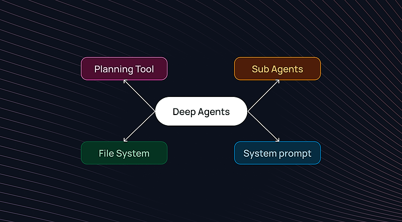
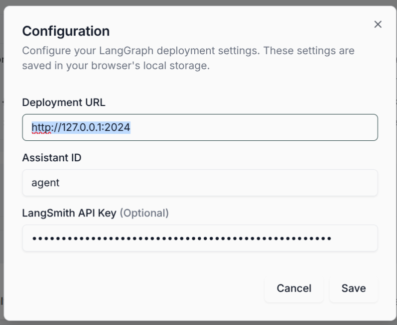
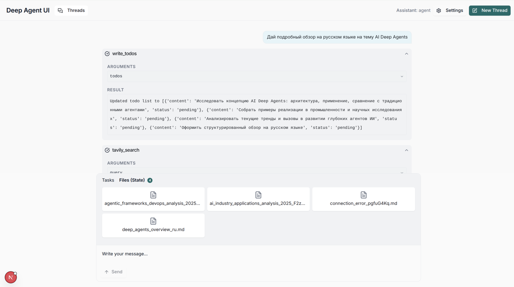

# 🧠 Local-Deep-Agents-from-Scratch

LocalDeepAgents_01

Создание локальных Deep Agents на базе **LangGraph**, **LLMs**, **файловой памяти**, **планирования** и **субагентов**.

---



Использованные материалы:

Учебный курс:
[https://academy.langchain.com/courses/deep-agents-with-langgraph](https://academy.langchain.com/courses/deep-agents-with-langgraph)
[https://github.com/langchain-ai/deep-agents-from-scratch](https://github.com/langchain-ai/deep-agents-from-scratch)

---

# 📌 Оглавление

1. [Введение](#введение)
2. [Архитектура Deep Agent](#архитектура-deep-agent)
3. [Базовый строительный блок: create_react_agent](#базовый-строительный-блок-create_react_agent)
4. [Планирование через todo-листы](#планирование-через-todo-листы)
5. [Внешняя память: файловая система](#внешняя-память-файловая-система)
6. [Субагенты и делегирование](#субагенты-и-делегирование)
7. [Think-tool: управляемая рефлексия](#think-tool-управляемая-рефлексия)
8. [Сборка Deep Research Agent](#сборка-deep-research-agent)
9. [DeepAgents — готовая абстракция](#deepagents--готовая-абстракция)
10. [Примеры кода](#примеры-кода)
11. [Запуск в UI (deep-agents-ui) на Ubuntu](#запуск-в-ui-deep-agents-ui-на-ubuntu)
12. [Решение проблемы fetchStateHistory](#решение-проблемы-fetchstatehistory)
13. [Тестирование](#тестирование)
14. [Заключение](#заключение)

---

# 🧭 Введение

Deep Agents — это архитектурный подход к созданию автономных агентов, устойчивых к длинным задачам (20–100+ шагов).
Основан на практиках систем:

* **Manus**
* **Claude Code**
* **OpenAI Deep Research**
* **Anthropic Multi-Agent Researcher**

Ключевые элементы:

* Планирование (todos)
* Контекстное offloading (files)
* Субагенты
* Системные промпты
* Модульная архитектура LangGraph


---
# 🧠 Обзор исходного кода модулей Deep Agents (from scratch)

Deep Agent состоит из четырёх основных модулей:

```
┌──────────────────────────┐
│        Supervisor        │
│     (главный агент)      │
└──────────┬───────────────┘
           │ Delegation
┌──────────▼───────────────┐
│        Subagent          │
│  (исследователь, кодер)  │
└──────────┬───────────────┘
           │ Tools
┌──────────▼───────────────┐
│  File System  |  Todos   │
│ (внешняя память агента   │
└──────────────────────────┘
```

---

# ⚙️ Базовый строительный блок: `create_react_agent`

LangGraph предоставляет преднастроенный агент ReAct:

```python
from langgraph.prebuilt import create_react_agent

agent = create_react_agent(
    model=my_llm,
    tools=[...],
    prompt="You are a helpful assistant."
)
```

Функции:

* управление состоянием,
* вызовы инструментов,
* условные переходы,
* визуализация графа,
* поддержка Command.


---

# 📝 Планирование через todo-листы

Пример todo-инструмента:

```python
@tool
def write_todos(todos: list[Todo], state: InjectedState, tool_call_id):
    return Command(update={
        "todos": todos,
        "messages": [ToolMessage("Todos updated", tool_call_id)]
    })
```

Todo-лист служит:

* планом действия,
* трекером прогресса,
* наброском траектории агента.

---

# 💾 Внешняя память: файловая система

Deep Agent хранит данные не в контексте LLM, а в state.files:

```python
files = {
  "page_1.md": "... markdown ...",
  "user_request.txt": "Find info about MCP"
}
```

Примеры инструментов:

```python
@tool
def write_file(path: str, content: str, state: InjectedState, tool_call_id):
    return Command(update={"files": {path: content}})
```

Используется для:

* raw tool calls,
* черновиков,
* промежуточных данных,
* больших текстов.

---

# 🤖 Субагенты и делегирование

Субагенты — это независимые агенты со своими промптами.

Пример описания субагента:

```python
research_subagent = {
  "name": "research-agent",
  "description": "Performs deep research tasks.",
  "prompt": "...",
  "tools": ["tavily_search", "read_file"]
}
```

Главный агент вызывает их через `task_tool`.

---

# 🧠 Think-tool: управляемая рефлексия

Это no-op инструмент:

```python
@tool
def think_tool(thought: str):
    return f"[THOUGHT]: {thought}"
```

Используется для:

* анализа прогресса,
* обнаружения ошибок,
* аудита reasoning.

---

# 🏗 Сборка Deep Research Agent

Система объединяет:

* todos,
* files,
* subagents,
* think-tool,
* Tavily search,
* summary модели.

Flow:

1. Сохранить запрос → файл
2. Составить todo-лист
3. Делегировать работу research-agent
4. Сохранить сырые данные (markdown)
5. Обновить todo
6. Вернуть финальный отчёт

---

# 📦 DeepAgents — готовая абстракция

Библиотека DeepAgents уже содержит:

* todo-инструменты,
* файловую систему,
* task_tool,
* think-tool,
* supervisor + subagent инфраструктуру.

Репозиторий доступен в разделе Resources.

---

# 🧪 Примеры кода

Пример вызова агента:

```python
result = agent.invoke({"messages": [
  {"role": "user", "content": "Give me an overview of MCP"}
]})
```

Пример чтения файлов:

```python
agent_state["files"]["page_1.md"]
```

---


---

# 🖥 Запуск в UI (deep-agents-ui) на Ubuntu

Этот проект можно запускать **в визуальном интерфейсе** `deep-agents-ui`, который показывает:

* чат с агентом,
* TODO-список,
* “файловую память” (state.files),
* tool calls и прерывания (interrupt/resume).
* 





## Предварительные требования

### 1) Python окружение

Предполагается, что виртуальное окружение уже создано и активируется так:

```bash
cd /home/konstantin/Proj/Local-Deep-Agents-from-Scratch
source .venv/bin/activate
```

### 2) Node.js + Yarn (рекомендованный способ через nvm)

Если UI ставится на “чистую” Ubuntu, удобнее всего поставить Node через `nvm`, а Yarn через `corepack`:

```bash
sudo apt update
sudo apt install -y curl git

# nvm
curl -o- https://raw.githubusercontent.com/nvm-sh/nvm/v0.39.7/install.sh | bash
source ~/.bashrc

# Node LTS
nvm install --lts
node -v
npm -v

# Yarn
corepack enable
yarn -v
```

## Установка UI (один раз)

Можно держать UI как отдельный репозиторий рядом, или (как в примере) — внутри проекта:

```bash
cd /home/konstantin/Proj/Local-Deep-Agents-from-Scratch
git clone https://github.com/langchain-ai/deep-agents-ui.git
cd deep-agents-ui
yarn install
```

## Запуск (будем использовать два терминала)

### Терминал №1 — LangGraph dev server (агент)

Успешный пример:

```bash
cd /home/konstantin/Proj/Local-Deep-Agents-from-Scratch
source .venv/bin/activate
cd Python
langgraph dev
```

После запуска сервер доступен по адресу:

* API: `http://127.0.0.1:2024`
* API Docs: `http://127.0.0.1:2024/docs`

Проверка, что сервер “жив”:

```bash
curl -I http://127.0.0.1:2024/docs
curl -s http://127.0.0.1:2024/ok; echo
```

Ожидаемо: `/docs` → 200 OK, `/ok` → `{"ok":true}`.

> Примечание: иногда CLI может вывести исключение в потоке `_open_browser` (авто-открытие браузера). Если `/docs` и `/ok` отвечают — сервер работает, это не критично.

### Терминал №2 — deep-agents-ui

Успешный пример:

```bash
cd /home/konstantin/Proj/Local-Deep-Agents-from-Scratch/deep-agents-ui
yarn dev
```

UI откроется на:

* `http://localhost:3000`

## Настройки UI

В интерфейсе открой **Settings** и укажи:

* **Deployment URL**: `http://127.0.0.1:2024`
* **Assistant ID**: `agent`

Где взять `Assistant ID`:

* это ключ графа из `langgraph.json` в секции `"graphs"` (в логах `langgraph dev` также видно: `Importing graph with id agent`).

---

# 🛠 Решение проблемы fetchStateHistory

## Симптомы

UI может упасть с ошибкой:

* `fetchStateHistory must be set to true to use history`

Это означает: UI обращается к `history` в SDK, но при создании stream не включена загрузка истории.

## Решение

Нужно добавить параметр `fetchStateHistory: true` в вызов `useStream(...)`.

Файл (в `deep-agents-ui`):

```
src/app/hooks/useChat.ts
```

Ищем блок:

```ts
const stream = useStream<StateType>({
  ...
});
```

Добавляем:

```ts
fetchStateHistory: true,
```

Пример:

```ts
const stream = useStream<StateType>({
  apiUrl: deploymentUrl,
  assistantId: activeAssistant?.assistant_id,
  threadId: activeThreadId,

  fetchStateHistory: true,

  // остальные опции...
});
```

После правки **обязательно перезапусти UI**:

```bash
# остановить Ctrl+C
yarn dev
```

Проверка, что правка применена:

```bash
rg -n "fetchStateHistory" src/app/hooks/useChat.ts
```

---

## Дополнительные типовые проблемы

### Порт 2024 занят (`Address already in use`)

Найти процесс:

```bash
sudo lsof -i :2024
```

Остановить процесс:

```bash
sudo kill -9 <PID>
```

И снова:

```bash
langgraph dev
```

---

# ✅ Тестирование

Пример вывода:
[OutPut_01.txt](OutPut_01.txt)


---

# 🏁 Заключение

Deep Agents — это:

* модульная архитектура,
* управляемое состояние,
* делегирование задач,
* внешняя память,
* мощные промпты.

Используя эти принципы, вы можете создавать:

* аналитические агенты,
* исследовательские системы,
* кодовые ассистенты,
* бизнес-агентов,
* сложные workflow-пайплайны.


